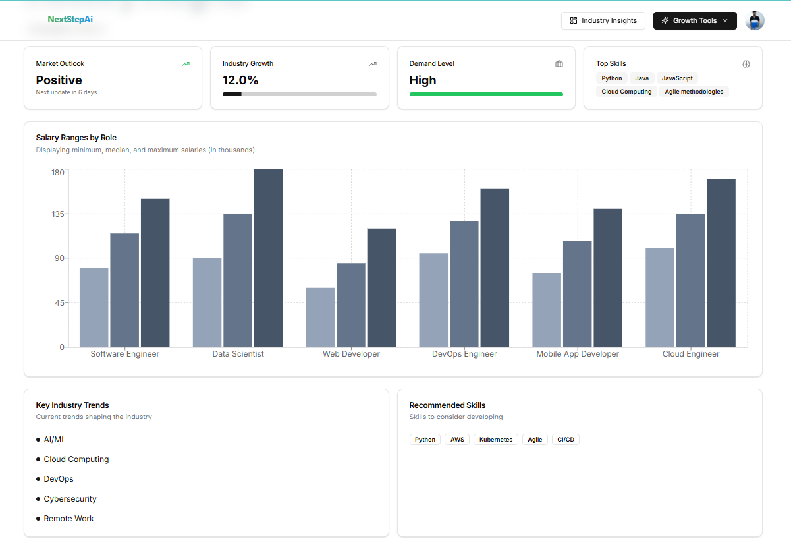
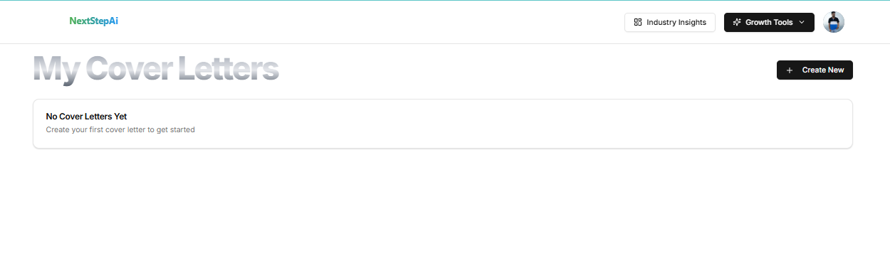

# 🚀 NextStepAi

An AI-powered Career Coaching Platform built with Next.js, Prisma, Tailwind, and Gemini API. NextStepAi helps users navigate their career journey by offering personalized insights, skill analysis, and structured guidance — all powered by modern AI.

---

## ✨ Features

-   🔐 **Authentication & User Management** – Powered by [Clerk](https://clerk.com/) for secure sign-up/sign-in.
-   🎨 **Modern UI** – Styled with [Tailwind CSS](https://tailwindcss.com/) and [shadcn/ui](https://ui.shadcn.com/).
-   🧠 **AI Career Coach** – Uses [Gemini API](https://ai.google.dev/) to generate personalized career insights.
-   📊 **Database Layer** – Built with [Prisma ORM](https://www.prisma.io/) and [Neon](https://neon.tech/) for scalable Postgres.
-   ⚡ **Asynchronous Jobs** – [Inngest](https://www.inngest.com/) for background tasks and workflows.
-   🌐 **Deployment Ready** – Optimized for [Vercel](https://vercel.com/).

---

## 🛠️ Tech Stack

-   **Frontend:** [Next.js](https://nextjs.org/) 13+ with App Router
-   **Styling:** [Tailwind CSS](https://tailwindcss.com/) + [shadcn/ui](https://ui.shadcn.com/)
-   **Backend / Database:** [Prisma](https://www.prisma.io/) + [Neon](https://neon.tech/) (PostgreSQL)
-   **Auth:** [Clerk](https://clerk.com/)
-   **AI Integration:** [Gemini API](https://ai.google.dev/)
-   **Job Queue / Events:** [Inngest](https://www.inngest.com/)
-   **Deployment:** [Vercel](https://vercel.com/)

---

# NextStepAi Features Overview

## 1. Landing Page of NextStepAi

The main landing page providing an overview of the platform and easy navigation to all features.

---

## 2. Login with Gmail using Clerk

Secure authentication using Gmail integration via Clerk.

---

## 3. Industry Insights

Data-driven insights about various industries to help users make informed career decisions.

---

## 4. Resume Builder

Create professional resumes with templates and AI-generated suggestions.

---

## 5. Cover Letter Builder

Generate tailored cover letters for job applications effortlessly.

---

## 6. Mock Quiz

Interactive quizzes for skill assessment and interview preparation.

---

## 7. ChatBot Using Gemini API

AI-powered conversational assistant integrated via Gemini API to answer career-related queries.

---

## 8. Career Workflow Generation using ReactFlow

Visualize career paths and workflows interactively using ReactFlow.

---

## ⚙️ Installation & Setup

1.  **Clone the repo**
    ```sh
    git clone [https://github.com/AYUSHRAHUL/NextStepAi.git](https://github.com/AYUSHRAHUL/NextStepAi.git)
    cd NextStepAi
    ```

2.  **Install dependencies**
    ```sh
    npm install
    # or
    yarn install
    # or
    pnpm install
    ```

3.  **Set up environment variables**

    Create a `.env.local` file in the root directory and add the following:
    ```env
    DATABASE_URL=postgres://<your-neon-db-url>
    NEXT_PUBLIC_CLERK_PUBLISHABLE_KEY=<your-clerk-publishable-key>
    CLERK_SECRET_KEY=<your-clerk-secret-key>

    NEXT_PUBLIC_CLERK_SIGN_IN_URL=/sign-in
    NEXT_PUBLIC_CLERK_SIGN_UP_URL=/sign-up
    NEXT_PUBLIC_CLERK_AFTER_SIGN_IN_URL=/onboarding
    NEXT_PUBLIC_CLERK_AFTER_SIGN_UP_URL=/onboarding

    GEMINI_API_KEY=<your-gemini-api-key>
    ```

4.  **Set up database**
    ```sh
    npx prisma generate
    npx prisma migrate dev
    ```

5.  **Run the development server**
    ```sh
    npm run dev
    ```

    Open http://localhost:3000 in your browser.

---

## 🚀 Deployment

This project is designed for [Vercel](https://vercel.com/).

-   Push your code to GitHub.
-   Connect the repo to Vercel.
-   Add your environment variables in Vercel Dashboard → Project Settings → Environment Variables.
-   Deploy 🎉

---

## 📖 Usage

-   Sign up or log in via Clerk.
-   Complete onboarding to personalize your experience.
-   Explore AI-powered career insights and recommendations.

---

## 🧪 Testing

```sh
npm run lint    # Run ESLint
npm run test    # Run tests (if configured)
🤝 Contributing
Contributions are welcome!

Fork the repo

Create your feature branch (git checkout -b feature/awesome-feature)

Commit your changes (git commit -m 'Add awesome feature')

Push to the branch (git push origin feature/awesome-feature)

Open a Pull Request

📜 License
This project is licensed under the MIT License.

🙌 Acknowledgements
Next.js

Tailwind CSS

Prisma

Clerk

Neon

Inngest

Gemini API
